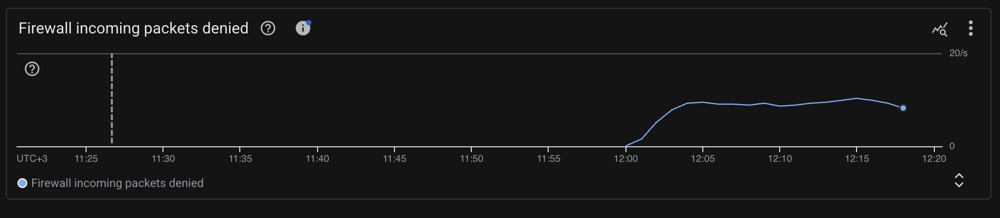
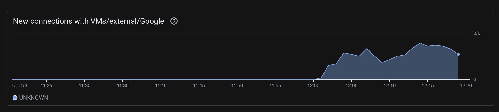

### Title: Postmortem: Dataproc SRE Lab Provisioning and YARN Alert Failure - 2026-06-12
**Authors/Roles:** Natneam (Incident Commander), Jhon Doe (Platform Engineer)
**Status:** Published

**Summary:** 
During a Dataproc SRE Lab exercise, two test scenarios failed. First, a test egress firewall rule blocked required HTTPS traffic, preventing Dataproc cluster creation and causing Terraform to hang for ~28 minutes. Second, a YARN queue alert test failed to trigger because jobs were bottlenecked in the Dataproc master queue rather than reaching the YARN scheduling layer.

**Impact:** 
* **Infrastructure:** Dataproc cluster provisioning completely failed. 
* **Developer Velocity:** Terraform executions hung for ~28 minutes per run before timing out, wasting engineering time.
* **Monitoring:** The initial queue test produced a false negative (the pending-application alert failed to fire). 
* **Data Loss:** None. This occurred strictly within an infrastructure/alert-test lab environment.

**Root Cause:** 
There were two distinct root causes:
1. **Network Blockage:** The test egress deny rule blocked TCP port 443. Dataproc nodes require HTTPS access to Google APIs and managed services during provisioning and operation; without this, the nodes could not signal successful creation.
2. **Architectural Misunderstanding (Queuing Layers):** The test assumed the Dataproc jobs queue was identical to the YARN application queue. However, Dataproc Jobs API submissions use client mode by default. The 8 GB master node hit its limit of running client-mode drivers, queuing the remaining jobs internally (Status: `RUNNING`, Substate: `QUEUED`, Detail: `Too many running jobs`). Because these jobs never reached YARN, the `cluster_yarn_apps{status="pending"}` metric remained un-triggered.

**Trigger:** 
* Enabling the experimental egress deny firewall rule.
* Executing the "Queue Fast Burn" load test by submitting multiple normal Dataproc jobs in a tight loop.

**Resolution:** 
* **Network:** The experimental egress rule was kept disabled by default. The secure subnet was verified to retain Private Google Access and Cloud NAT to reach required Google services.
* **Alerting:** The YARN test was rewritten to submit a single lightweight orchestrator as a Dataproc job. This orchestrator runs `spark-submit` directly on the master using `--master yarn --deploy-mode cluster`, bypassing the Dataproc client-mode bottleneck. It successfully spawned multiple independent applications with 5 GB drivers, saturating the workers, filling the YARN `ACCEPTED` queue, and successfully triggering the alert after 4 minutes.

**Detection:** 
* The network issue was detected visually via monitoring screenshots showing denied firewall traffic and Terraform outputting an `http2: client connection lost` error after 28 minutes.
* The alert test failure was detected by observing Dataproc job states (`Too many running jobs`) without receiving the expected YARN alert page. 

### Network evidence

Both charts show activity starting shortly after 12:00 and continuing through 
approximately 12:19. The new-connection activity is consistent with cluster 
provisioning attempts, while the denied-packet chart shows the firewall rejecting
traffic during the same period.

*Figure 1: Firewall incoming packets denied. The chart is labeled `UTC`; the
rate rises just after 12:00 and remains elevated through the captured window.*

*Figure 2: New connections with VMs, external endpoints, and Google services.
Activity begins just after 12:00 UTC and overlaps the denied-packet activity.*

**Action Items:**

| Action Item | Type | Owner | Bug/Ticket |
| :--- | :--- | :--- | :--- |
| Keep `block_google_apis_egress` commented out in Terraform unless intentionally running a firewall experiment. | Prevent | Natneam | LAB-101 |
| Add a documented, fast-failing connectivity preflight check before Dataproc cluster creation. | Prevent | Natneam | LAB-102 |
| Update testing runbooks to explicitly use the `cluster` deploy-mode orchestrator for future YARN pending-application alert tests. | Process | Natneam | LAB-103 |
| Create dashboard panels to monitor raw YARN applications (via ResourceManager UI or Cloud Monitoring) since `spark-submit` apps bypass the Dataproc jobs list. | Detect | Natneam | LAB-104 |

**Lessons Learned:**
* **What went well:** The redesigned orchestrator strategy perfectly simulated the intended YARN saturation state, proving the alert logic itself was sound once the data reached the correct queue.
* **What went wrong:** We waited nearly 30 minutes for predictable failures because Terraform polling limits were too long for network testing. Furthermore, we conflated Dataproc job states with YARN application states.
* **Where we got lucky:** This was a lab environment. Had a restrictive egress rule been applied to a production cluster, it would have severed control-plane connectivity.

**Timeline (UTC):**
* **12:00:** Firewall test activity begins. The screenshots show new connections
	and denied packets beginning shortly after this time.
* **12:02:** Terraform `apply` initiated to create the Dataproc cluster.
* **12:05:** Denied traffic becomes sustained while cluster provisioning is in
	progress. The monitoring screenshots cover approximately 12:00-12:19.
* **12:30:** Terraform fails after approximately 28 minutes with
	`error while retrieving operation: ... http2: client connection lost`.
* **12:45:** Egress rule disabled; Dataproc cluster successfully provisioned.
* **13:00:** "Queue Fast Burn" test initiated with 15 Dataproc API jobs.
* **13:05:** Five jobs run and ten queue on the master. The YARN queue remains
	empty, so the alert test fails.
* **13:30:** Team redesigns the test using a lightweight `cluster` mode
	orchestrator.
* **13:45:** Orchestrator test executed. Four large AM/driver containers
	saturate the cluster.
* **13:47:** Seven applications enter YARN `ACCEPTED` state (`status="pending"`).
	The metric threshold (`>2`) is breached.
* **13:49:** YARN Pending Application alert successfully fires. Incident/lab
	resolved.